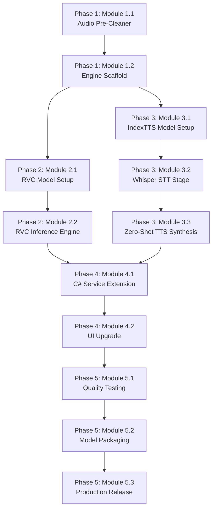

# 🗺️ Neural V2V Studio — Professional Development Roadmap
> **Project:** VoiceToText Pro — Voice-to-Voice Conversion Module Overhaul
> **Created:** 2026-08-20
> **Last Updated:** 2026-08-20
> **Status:** ⬜ Not Started
> **Owner:** @yekaweb

---

## Vision Statement
Replace the legacy DSP pitch-shifting engine with a **dual-mode neural voice conversion system** powered by **IndexTTS 2** (zero-noise cascaded STT→TTS cloning) and **RVC v2** (direct neural voice transfer), producing studio-grade audio output with zero background noise.

---

## Architecture Overview

```
┌────────────────────────────────────────────────────────────────────────────┐
│                        VoiceToText Pro (C# WPF)                          │
│  ┌──────────────────────────────────────────────────────────────────────┐ │
│  │  VoiceConverterTab.xaml  ←→  VoiceConverterService.cs (C# Bridge)   │ │
│  └──────────────────────────────────┬───────────────────────────────────┘ │
│                                     │ Process spawn + JSON stdout        │
│  ┌──────────────────────────────────▼───────────────────────────────────┐ │
│  │                    v2v_worker.py (Python Engine)                     │ │
│  │  ┌─────────────┐  ┌───────────────────┐  ┌───────────────────────┐  │ │
│  │  │  Pre-Clean   │  │  Engine A: RVC v2 │  │ Engine B: IndexTTS 2 │  │ │
│  │  │  (Demucs/    │→ │  (ContentVec +    │  │ (Whisper STT →       │  │ │
│  │  │   UVR5)      │  │   HiFi-GAN)       │  │  Zero-Shot TTS)      │  │ │
│  │  └─────────────┘  └───────────────────┘  └───────────────────────┘  │ │
│  └─────────────────────────────────────────────────────────────────────┘  │
└────────────────────────────────────────────────────────────────────────────┘
```

---

## Existing Project Assets (Reuse Analysis)

| Existing Asset | Path | Reuse Strategy |
|---|---|---|
| Python worker bridge | `Services/PythonBridge.cs` | ✅ Extend for new v2v_worker args |
| V2V C# service | `Services/VoiceConverterService.cs` | ✅ Add engine mode param to `ConvertVoiceAsync` |
| V2V Python worker | `publish/workers/voice_converter.py` | 🔄 Refactor: keep as fallback, add neural engines |
| Voice profiles dir | `models/voice_profiles/` | ✅ Reuse for reference audio storage |
| Whisper integration | `publish/workers/main_worker.py` | ✅ Reuse Faster-Whisper for STT stage |
| V2V Tab UI | `Tabs/VoiceConverterTab.xaml` | ✅ Extend with engine selector dropdown |
| V2V Tab code-behind | `Tabs/VoiceConverterTab.xaml.cs` | ✅ Extend with engine mode logic |
| Settings service | `Services/AppSettings.cs` | ✅ Add V2V engine preference setting |
| Glassmorphism styles | `Styles/GlassmorphismResources.xaml` | ✅ Reuse glass card styles for new UI |

---

# Phase 1: Foundation — Audio Pre-Processing & Engine Scaffold
> **Purpose:** Build the Python engine scaffold with audio pre-cleaning and prepare the dual-engine architecture.
> **Scope:** Python worker only — no C# UI changes yet.
> **Expected Result:** `v2v_worker.py` can accept `--engine` flag and route to correct backend; audio pre-cleaning removes noise before processing.
> **Dependencies:** Python 3.10+, pip packages (demucs/UVR5, numpy, soundfile)
> **Estimated Complexity:** Medium (Week 1-2)
> **Definition of Done:** Running `v2v_worker.py --engine demucs_test --source_wav test.wav --output_wav out.wav` produces a cleaned audio file.

## Module 1.1: Audio Pre-Cleaner (Demucs / UVR5 Integration)
> **Purpose:** Strip background noise, music, and room hum from source audio before any neural processing.
> **Dependencies:** None (foundation module)
> **Status:** ⬜ Not Started

- ⬜ **Task 1.1.1:** Research & select optimal vocal isolation model
    - ⬜ Compare Demucs v4 vs UVR5 MDX-Net for vocal isolation quality
    - ⬜ Benchmark processing time per 30-second audio chunk
    - ⬜ Select model with best CPU performance / quality ratio
    - Dependencies: None
    - Definition of Done: Decision documented with benchmarks

- ⬜ **Task 1.1.2:** Implement `AudioPreCleaner` class in `v2v_worker.py`
    - ⬜ Create `class AudioPreCleaner` with `clean(input_path, output_path)` method
    - ⬜ Load Demucs/UVR5 model on first call with lazy initialization
    - ⬜ Extract clean vocals track, discard accompaniment/noise tracks
    - ⬜ Output 22050 Hz mono WAV to temp directory
    - ⬜ Add JSON progress reporting (`{"status": "cleaning", "progress": N}`)
    - Dependencies: Task 1.1.1
    - Definition of Done: `clean()` produces noise-free vocal WAV from noisy input

- ⬜ **Task 1.1.3:** Add `--precleaner` CLI argument to `v2v_worker.py`
    - ⬜ Wire `--precleaner` flag (default: `auto`) to `AudioPreCleaner` before engine
    - ⬜ Support values: `auto`, `demucs`, `uvr5`, `none`
    - Dependencies: Task 1.1.2
    - Definition of Done: `--precleaner demucs` strips noise from test audio

## Module 1.2: Engine Routing & Scaffold Architecture
> **Purpose:** Refactor `v2v_worker.py` from single-path to multi-engine with clean dispatch.
> **Dependencies:** None
> **Status:** ⬜ Not Started

- ⬜ **Task 1.2.1:** Refactor `v2v_worker.py` into modular engine architecture
    - ⬜ Create `class V2VEngineBase` (abstract base with `convert()` method)
    - ⬜ Move existing DSP code into `class LegacyDSPEngine(V2VEngineBase)`
    - ⬜ Create empty `class RVCEngine(V2VEngineBase)` placeholder
    - ⬜ Create empty `class IndexTTSEngine(V2VEngineBase)` placeholder
    - ⬜ Create `class EngineFactory` that returns engine by `--engine` arg
    - Dependencies: None
    - Definition of Done: Existing DSP engine still works via `--engine legacy`

- ⬜ **Task 1.2.2:** Add `--engine` CLI argument to `v2v_worker.py`
    - ⬜ Supported values: `legacy`, `rvc`, `indextts`, `auto`
    - ⬜ `auto` mode selects best available engine based on installed packages
    - ⬜ Update JSON progress messages per engine type
    - Dependencies: Task 1.2.1
    - Definition of Done: `--engine legacy` produces same output as current code

---

# Phase 2: Neural Engine A — RVC v2 Direct Voice Conversion
> **Purpose:** Integrate RVC v2 for high-quality direct voice-to-voice conversion preserving speech cadence.
> **Scope:** Python worker `RVCEngine` class; no C# changes yet.
> **Expected Result:** Source audio is converted to target speaker timbre in real-time with RMVPE pitch tracking and HiFi-GAN vocoder.
> **Dependencies:** Phase 1 complete, PyTorch or ONNX Runtime, RVC pre-trained models
> **Estimated Complexity:** High (Week 2-3)
> **Definition of Done:** `v2v_worker.py --engine rvc --source_wav input.wav --target_profile speaker.wav --output_wav out.wav` produces clean converted audio matching target speaker timbre.

## Module 2.1: RVC v2 Model Acquisition & Setup
> **Purpose:** Download, validate, and configure RVC v2 pre-trained model weights.
> **Dependencies:** Phase 1 Module 1.2 complete
> **Status:** ⬜ Not Started

- ⬜ **Task 2.1.1:** Download RVC v2 pre-trained base models
    - ⬜ Download ContentVec/HuBERT feature extractor (`.pt` / `.onnx`)
    - ⬜ Download RMVPE pitch estimator model (`.pt` / `.onnx`)
    - ⬜ Download HiFi-GAN vocoder checkpoint
    - ⬜ Store in `publish/workers/v2v_models/rvc/` directory
    - Dependencies: Internet access, storage (~500MB)
    - Definition of Done: All model files validated and loadable

- ⬜ **Task 2.1.2:** Create ONNX-quantized versions for CPU-only systems
    - ⬜ Convert ContentVec to ONNX INT8 quantized format
    - ⬜ Convert RMVPE to ONNX INT8 quantized format
    - ⬜ Verify ONNX Runtime inference matches PyTorch output (RMSE < 0.01)
    - Dependencies: Task 2.1.1
    - Definition of Done: ONNX models run on CPU without PyTorch installed

## Module 2.2: RVC v2 Inference Engine Implementation
> **Purpose:** Implement the full RVC v2 conversion pipeline inside `RVCEngine` class.
> **Dependencies:** Module 2.1 complete
> **Status:** ⬜ Not Started

- ⬜ **Task 2.2.1:** Implement ContentVec feature extraction
    - ⬜ Load ContentVec model (PyTorch or ONNX)
    - ⬜ Extract linguistic feature vectors from source audio (256-dim per frame)
    - ⬜ Implement Faiss index search for speaker timbre matching
    - Dependencies: Task 2.1.1
    - Definition of Done: Feature vectors extracted matching reference implementation

- ⬜ **Task 2.2.2:** Implement RMVPE pitch tracking
    - ⬜ Load RMVPE model
    - ⬜ Extract F0 (fundamental frequency) contour from source audio
    - ⬜ Apply pitch shift (semitones) and formant preservation
    - ⬜ Implement automatic male↔female formant scaling
    - Dependencies: Task 2.1.1
    - Definition of Done: F0 contour matches librosa reference with < 5% deviation

- ⬜ **Task 2.2.3:** Implement HiFi-GAN neural vocoder synthesis
    - ⬜ Load HiFi-GAN vocoder model
    - ⬜ Synthesize waveform from ContentVec features + F0 contour + speaker embedding
    - ⬜ Apply peak normalization (-1.0 dBFS)
    - ⬜ Output 22050 Hz 16-bit mono WAV
    - Dependencies: Tasks 2.2.1, 2.2.2
    - Definition of Done: Output audio is clean, artifact-free, and matches target speaker

- ⬜ **Task 2.2.4:** Wire `RVCEngine.convert()` full pipeline
    - ⬜ Integrate pre-cleaner → ContentVec → RMVPE → HiFi-GAN → output
    - ⬜ Add JSON progress reporting at each stage
    - ⬜ Handle errors gracefully with fallback to legacy DSP
    - Dependencies: Tasks 2.2.1, 2.2.2, 2.2.3
    - Definition of Done: End-to-end RVC conversion works from CLI

---

# Phase 3: Neural Engine B — IndexTTS 2 / F5-TTS Cascaded STT→TTS Voice Cloning
> **Purpose:** Implement the zero-noise cascaded pipeline: Whisper transcribes source audio → IndexTTS 2 / F5-TTS synthesizes the text with target speaker voice.
> **Scope:** Python worker `IndexTTSEngine` class.
> **Expected Result:** 100% noise-free, studio-quality output voice matching target speaker exactly.
> **Dependencies:** Phase 1 complete, Faster-Whisper already in project
> **Estimated Complexity:** High (Week 3-4)
> **Definition of Done:** `v2v_worker.py --engine indextts --source_wav input.wav --target_profile speaker_5sec.wav --output_wav out.wav` produces pristine cloned speech.

## Module 3.1: IndexTTS 2 / F5-TTS Model Setup
> **Purpose:** Download and configure IndexTTS 2 or F5-TTS models for zero-shot voice cloning.
> **Dependencies:** Phase 1 complete
> **Status:** ⬜ Not Started

- ⬜ **Task 3.1.1:** Evaluate IndexTTS 2 vs F5-TTS for best fit
    - ⬜ Compare output quality, speed, and model size
    - ⬜ Test Persian/Farsi language support quality
    - ⬜ Test ONNX/CPU compatibility for both
    - ⬜ Select primary engine and document decision
    - Dependencies: None
    - Definition of Done: Decision documented with quality comparison audio samples

- ⬜ **Task 3.1.2:** Download selected model checkpoints
    - ⬜ Download IndexTTS 2 checkpoints (GPT + BigVGAN vocoder) OR F5-TTS ONNX weights
    - ⬜ Store in `publish/workers/v2v_models/indextts/` or `v2v_models/f5tts/`
    - ⬜ Create model config JSON for inference parameters
    - Dependencies: Task 3.1.1
    - Definition of Done: Models loadable and inference-ready

## Module 3.2: Whisper STT → Text Extraction Stage
> **Purpose:** Transcribe source audio to clean text with word-level timestamps for duration matching.
> **Dependencies:** Module 3.1, existing Faster-Whisper in `main_worker.py`
> **Status:** ⬜ Not Started

- ⬜ **Task 3.2.1:** Reuse Faster-Whisper from existing `main_worker.py`
    - ⬜ Import or refactor shared Whisper loading logic from `main_worker.py`
    - ⬜ Extract full transcript with word-level timestamps
    - ⬜ Extract language detection result for TTS language selection
    - Dependencies: Existing `main_worker.py` Whisper integration
    - Definition of Done: `transcribe(audio_path)` returns `{text, words: [{word, start, end}], language}`

- ⬜ **Task 3.2.2:** Implement sentence-level chunking with timing alignment
    - ⬜ Split transcript into sentence chunks (by punctuation + pause detection)
    - ⬜ Calculate per-sentence target duration from source timestamps
    - ⬜ Generate `[{sentence, target_duration_ms, start_ms, end_ms}]` list
    - Dependencies: Task 3.2.1
    - Definition of Done: Sentence list with timing metadata matches source audio structure

## Module 3.3: Zero-Shot TTS Synthesis Engine
> **Purpose:** Synthesize each sentence with target speaker voice using IndexTTS 2 / F5-TTS.
> **Dependencies:** Modules 3.1 and 3.2 complete
> **Status:** ⬜ Not Started

- ⬜ **Task 3.3.1:** Implement speaker reference embedding extraction
    - ⬜ Load 3-5 second target speaker WAV/MP3 reference file
    - ⬜ Extract speaker embedding / latent representation
    - ⬜ Cache embedding for reuse across sentences
    - Dependencies: Task 3.1.2
    - Definition of Done: Speaker embedding vector extracted and cacheable

- ⬜ **Task 3.3.2:** Implement sentence-by-sentence TTS synthesis
    - ⬜ For each sentence chunk: synthesize with target speaker embedding
    - ⬜ Apply duration control to match source sentence timing
    - ⬜ Handle silence gaps between sentences
    - ⬜ Add JSON progress reporting per sentence
    - Dependencies: Tasks 3.2.2, 3.3.1
    - Definition of Done: Each sentence synthesized cleanly in target voice

- ⬜ **Task 3.3.3:** Implement audio stitching & crossfade assembly
    - ⬜ Concatenate all synthesized sentence chunks
    - ⬜ Apply 50ms crossfade between adjacent chunks
    - ⬜ Match total output duration to source audio duration (±5%)
    - ⬜ Apply peak normalization (-1.0 dBFS)
    - Dependencies: Task 3.3.2
    - Definition of Done: Single continuous WAV file matching source duration

- ⬜ **Task 3.3.4:** Wire `IndexTTSEngine.convert()` full pipeline
    - ⬜ Integrate: pre-clean → Whisper STT → sentence split → TTS synthesis → stitch → output
    - ⬜ Add comprehensive JSON progress reporting
    - ⬜ Handle errors gracefully with informative messages
    - Dependencies: Tasks 3.3.1, 3.3.2, 3.3.3
    - Definition of Done: End-to-end IndexTTS conversion works from CLI

---

# Phase 4: C# Frontend & UI Integration
> **Purpose:** Update the WPF VoiceConverterTab UI to expose dual engine modes and connect to the upgraded Python worker.
> **Scope:** C# WPF frontend only — `VoiceConverterTab.xaml`, `VoiceConverterTab.xaml.cs`, `VoiceConverterService.cs`, `AppSettings.cs`.
> **Expected Result:** Users can select between "Studio Clone (Zero Noise)" and "Direct Neural V2V" modes in the UI.
> **Dependencies:** Phases 2 and 3 complete (at least one engine working)
> **Estimated Complexity:** Medium (Week 4-5)
> **Definition of Done:** User can select engine mode, upload source audio, select target voice profile, and receive high-quality converted audio — all from the WPF UI.

## Module 4.1: VoiceConverterService.cs Engine Mode Extension
> **Purpose:** Extend the C# service to pass `--engine` and `--precleaner` arguments to the Python worker.
> **Dependencies:** Phases 2 or 3 (at least one engine)
> **Status:** ⬜ Not Started

- ⬜ **Task 4.1.1:** Add `V2VEngineMode` enum to `VoiceConverterService.cs`
    - ⬜ Define enum: `Auto`, `StudioClone`, `DirectNeural`, `Legacy`
    - ⬜ Add engine mode parameter to `ConvertVoiceAsync()` method signature
    - ⬜ Map enum to `--engine` CLI argument values
    - Dependencies: Phase 1 Task 1.2.2 complete
    - Definition of Done: Service accepts engine mode parameter

- ⬜ **Task 4.1.2:** Update process argument builder in `ConvertVoiceAsync()`
    - ⬜ Add `--engine {mode}` to process start arguments
    - ⬜ Add `--precleaner auto` to process start arguments
    - ⬜ Parse new progress stages from Python (cleaning, transcribing, synthesizing)
    - Dependencies: Task 4.1.1
    - Definition of Done: C# correctly launches Python with engine mode

- ⬜ **Task 4.1.3:** Add V2V engine preference to `AppSettings.cs`
    - ⬜ Add `V2VDefaultEngine` setting property (default: `"auto"`)
    - ⬜ Add `V2VPreCleanerEnabled` setting property (default: `true`)
    - ⬜ Wire settings to SettingsWindow UI
    - Dependencies: Task 4.1.1
    - Definition of Done: Engine preference persists across sessions

## Module 4.2: VoiceConverterTab UI Upgrade
> **Purpose:** Add engine selector, improved status feedback, and remove BETA tag after quality is production-ready.
> **Dependencies:** Module 4.1 complete
> **Status:** ⬜ Not Started

- ⬜ **Task 4.2.1:** Add Engine Mode selector ComboBox to `VoiceConverterTab.xaml`
    - ⬜ Add labeled ComboBox with glassmorphism styling between profile selector and controls
    - ⬜ Options: "🎙️ شبیه‌سازی استودیویی (بدون نویز)", "⚡ تبدیل مستقیم عصبی (سریع)", "🔧 موتور قدیمی (DSP)"
    - ⬜ Add tooltip explaining each mode
    - Dependencies: Module 4.1
    - Definition of Done: Engine mode ComboBox visible and functional in UI

- ⬜ **Task 4.2.2:** Add multi-stage progress feedback to UI
    - ⬜ Update `StatusText` to show current pipeline stage (Cleaning → Transcribing → Synthesizing → Stitching)
    - ⬜ Add colored stage indicators (icons per stage)
    - ⬜ Show estimated time remaining based on audio duration
    - Dependencies: Task 4.2.1
    - Definition of Done: Users see detailed progress through conversion pipeline

- ⬜ **Task 4.2.3:** Wire `ConvertVoiceBtn_Click` to pass selected engine mode
    - ⬜ Read selected engine mode from ComboBox
    - ⬜ Pass mode to `VoiceConverterService.ConvertVoiceAsync()`
    - ⬜ Handle engine-specific error messages
    - Dependencies: Tasks 4.2.1, 4.1.2
    - Definition of Done: Clicking Convert uses selected engine mode

- ⬜ **Task 4.2.4:** Upgrade speaker profile management for reference audio
    - ⬜ Update RecordProfile to validate minimum 3-second duration
    - ⬜ Show audio duration and quality indicator on profile selection
    - ⬜ Add "Play Preview" button for reference audio profiles
    - Dependencies: Task 4.2.1
    - Definition of Done: Speaker profiles show duration and are playable

---

# Phase 5: Quality Assurance, Optimization & Release
> **Purpose:** End-to-end testing, performance optimization, model packaging, and production release.
> **Scope:** Full system integration testing, ONNX quantization, latency benchmarks.
> **Expected Result:** V2V module is production-ready with < 3 second latency per 10-sec audio on CPU, zero noise output.
> **Dependencies:** Phases 1-4 complete
> **Estimated Complexity:** Medium (Week 5-6)
> **Definition of Done:** All A/B quality tests pass, BETA tag removed, performance benchmarks documented.

## Module 5.1: Integration Testing & Quality Validation
> **Purpose:** Validate output quality across diverse input scenarios.
> **Dependencies:** Phase 4 complete
> **Status:** ⬜ Not Started

- ⬜ **Task 5.1.1:** Create test audio corpus
    - ⬜ 5 Persian male voice samples (clean + noisy)
    - ⬜ 5 Persian female voice samples (clean + noisy)
    - ⬜ 3 English voice samples (mixed)
    - ⬜ 2 background music + voice overlay samples
    - Dependencies: None
    - Definition of Done: 15 test audio files created and cataloged

- ⬜ **Task 5.1.2:** Run A/B quality comparison tests
    - ⬜ Convert each test file with Legacy DSP, RVC v2, and IndexTTS engines
    - ⬜ Score each output: Noise Level (1-5), Timbre Match (1-5), Naturalness (1-5)
    - ⬜ Document results in comparison table
    - Dependencies: Task 5.1.1
    - Definition of Done: All engines scored; IndexTTS/RVC score > 4.0 average

- ⬜ **Task 5.1.3:** Latency benchmarking
    - ⬜ Benchmark each engine on CPU (Intel i5 / Ryzen 5 class)
    - ⬜ Benchmark each engine on GPU (RTX 3060 class)
    - ⬜ Target: < 3 sec per 10-sec audio on CPU, < 1 sec on GPU
    - Dependencies: Task 5.1.2
    - Definition of Done: Benchmark table published

## Module 5.2: Model Packaging & Distribution
> **Purpose:** Package optimized models for end-user distribution via model manager.
> **Dependencies:** Module 5.1 complete
> **Status:** ⬜ Not Started

- ⬜ **Task 5.2.1:** Create ONNX-quantized model packages
    - ⬜ Quantize all models to INT8 ONNX for CPU distribution
    - ⬜ Package as downloadable model sets in model manager
    - ⬜ Add model integrity verification checksums
    - Dependencies: Module 5.1
    - Definition of Done: Models downloadable via existing ModelDownloadManager

- ⬜ **Task 5.2.2:** Bundle high-quality preset voice profiles
    - ⬜ Create 3 high-quality female Persian voice presets
    - ⬜ Create 3 high-quality male Persian voice presets
    - ⬜ Create 2 English narrator presets
    - ⬜ Package in `models/voice_profiles/` with metadata JSON
    - Dependencies: Task 5.2.1
    - Definition of Done: Preset profiles produce excellent output quality

## Module 5.3: Production Release
> **Purpose:** Remove BETA tag, publish release, update documentation.
> **Dependencies:** Modules 5.1 and 5.2 complete
> **Status:** ⬜ Not Started

- ⬜ **Task 5.3.1:** Remove BETA badge from V2V tab
    - ⬜ Remove BETA border from `VoiceConverterTab.xaml` header
    - ⬜ Remove BETA badge from `MainWindow.xaml` sidebar
    - ⬜ Update tab subtitle to reflect production status
    - Dependencies: Quality tests passing (Module 5.1)
    - Definition of Done: No BETA badges visible in V2V tab

- ⬜ **Task 5.3.2:** Update user documentation & changelog
    - ⬜ Update README with new V2V features
    - ⬜ Add changelog entry for Neural V2V Studio release
    - ⬜ Document engine modes and recommended settings
    - Dependencies: Task 5.3.1
    - Definition of Done: Documentation complete and accurate

- ⬜ **Task 5.3.3:** Final build, publish & Git push
    - ⬜ Full Release build with all models
    - ⬜ Smoke test on clean Windows install
    - ⬜ Git commit, tag release version, push to main
    - Dependencies: Tasks 5.3.1, 5.3.2
    - Definition of Done: Tagged release published to GitHub

---

## Progress Summary

| Phase | Status | Modules | Progress |
|---|---|---|---|
| Phase 1: Foundation | ⬜ Not Started | 2 modules, 5 tasks | 0% |
| Phase 2: RVC v2 Engine | ⬜ Not Started | 2 modules, 6 tasks | 0% |
| Phase 3: IndexTTS 2 Engine | ⬜ Not Started | 3 modules, 8 tasks | 0% |
| Phase 4: C# UI Integration | ⬜ Not Started | 2 modules, 7 tasks | 0% |
| Phase 5: QA & Release | ⬜ Not Started | 3 modules, 8 tasks | 0% |
| **Total** | **⬜ Not Started** | **12 modules, 34 tasks** | **0%** |

---

## Dependency Graph



---

## Next Recommended Action
> 🎯 **Start Phase 1, Module 1.1, Task 1.1.1**: Research and benchmark Demucs v4 vs UVR5 MDX-Net for vocal isolation.

⏳ **Awaiting user approval to begin Phase 1.**
