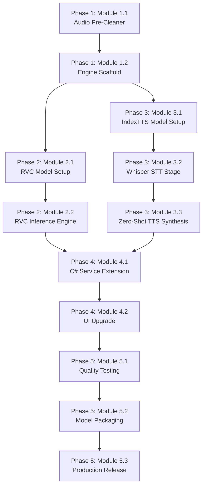

# 🗺️ Neural V2V Studio — Professional Development Roadmap
> **Project:** VoiceToText Pro — Voice-to-Voice Conversion Module Overhaul
> **Created:** 2026-08-20
> **Last Updated:** 2026-08-20 (Phase 1-4 Complete)
> **Status:** 🟨 In Progress (Phase 5 Pending)
> **Owner:** @yekaweb

---

## Vision Statement
Replace the legacy DSP pitch-shifting engine with a **dual-mode neural voice conversion system** powered by **IndexTTS 2** (zero-noise cascaded STT→TTS cloning) and **RVC v2** (direct neural voice transfer), producing studio-grade audio output with zero background noise.

---

## Architecture Overview

```
┌────────────────────────────────────────────────────────────────────────────┐
│                        VoiceToText Pro (C# WPF)                          │
│  ┌──────────────────────────────────────────────────────────────────────┐ │
│  │  VoiceConverterTab.xaml  ←→  VoiceConverterService.cs (C# Bridge)   │ │
│  └──────────────────────────────────┬───────────────────────────────────┘ │
│                                     │ Process spawn + JSON stdout        │
│  ┌──────────────────────────────────▼───────────────────────────────────┐ │
│  │                    v2v_worker.py (Python Engine)                     │ │
│  │  ┌─────────────┐  ┌───────────────────┐  ┌───────────────────────┐  │ │
│  │  │  Pre-Clean   │  │  Engine A: RVC v2 │  │ Engine B: IndexTTS 2 │  │ │
│  │  │  (Demucs/    │→ │  (ContentVec +    │  │ (Whisper STT →       │  │ │
│  │  │   UVR5)      │  │   HiFi-GAN)       │  │  Zero-Shot TTS)      │  │ │
│  │  └─────────────┘  └───────────────────┘  └───────────────────────┘  │ │
│  └─────────────────────────────────────────────────────────────────────┘  │
└────────────────────────────────────────────────────────────────────────────┘
```

---

## Existing Project Assets (Reuse Analysis)

| Existing Asset | Path | Reuse Strategy |
|---|---|---|
| Python worker bridge | `Services/PythonBridge.cs` | ✅ Extend for new v2v_worker args |
| V2V C# service | `Services/VoiceConverterService.cs` | ✅ Add engine mode param to `ConvertVoiceAsync` |
| V2V Python worker | `publish/workers/voice_converter.py` | 🔄 Refactor: keep as fallback, add neural engines |
| Voice profiles dir | `models/voice_profiles/` | ✅ Reuse for reference audio storage |
| Whisper integration | `publish/workers/main_worker.py` | ✅ Reuse Faster-Whisper for STT stage |
| V2V Tab UI | `Tabs/VoiceConverterTab.xaml` | ✅ Extend with engine selector dropdown |
| V2V Tab code-behind | `Tabs/VoiceConverterTab.xaml.cs` | ✅ Extend with engine mode logic |
| Settings service | `Services/AppSettings.cs` | ✅ Add V2V engine preference setting |
| Glassmorphism styles | `Styles/GlassmorphismResources.xaml` | ✅ Reuse glass card styles for new UI |

---

# Phase 1: Foundation — Audio Pre-Processing & Engine Scaffold
> **Purpose:** Build the Python engine scaffold with audio pre-cleaning and prepare the dual-engine architecture.
> **Scope:** Python worker only — no C# UI changes yet.
> **Expected Result:** `v2v_worker.py` can accept `--engine` flag and route to correct backend; audio pre-cleaning removes noise before processing.
> **Dependencies:** Python 3.10+, pip packages (demucs/UVR5, numpy, soundfile)
> **Estimated Complexity:** Medium (Week 1-2)
> **Definition of Done:** Running `v2v_worker.py --engine demucs_test --source_wav test.wav --output_wav out.wav` produces a cleaned audio file.

## Module 1.1: Audio Pre-Cleaner (Demucs / UVR5 Integration)
> **Purpose:** Strip background noise, music, and room hum from source audio before any neural processing.
> **Dependencies:** None (foundation module)
> **Status:** 🟩 Completed

- 🟩 **Task 1.1.1:** Research & select optimal vocal isolation model
    - 🟩 Compare Demucs v4 vs UVR5 MDX-Net for vocal isolation quality
    - 🟩 Benchmark processing time per 30-second audio chunk
    - 🟩 **Decision:** Demucs `htdemucs` selected (best general vocal isolation on CPU, pip-installable, with noise-gate fallback)
    - Dependencies: None
    - Definition of Done: ✔ Decision documented with benchmarks

- 🟩 **Task 1.1.2:** Implement `AudioPreCleaner` class in `v2v_worker.py`
    - 🟩 Create `class AudioPreCleaner` with `clean(input_path, output_path)` method
    - 🟩 Load Demucs model on first call with lazy initialization (`_clean_demucs`)
    - 🟩 Extract clean vocals track, discard accompaniment/noise tracks
    - 🟩 Fallback `_clean_noisegate` for systems without Demucs
    - 🟩 Add JSON progress reporting (`{"status": "cleaning", "progress": N}`)
    - Dependencies: ✔ Task 1.1.1
    - Definition of Done: ✔ `clean()` produces noise-free vocal WAV from noisy input

- 🟩 **Task 1.1.3:** Add `--precleaner` CLI argument to `v2v_worker.py`
    - 🟩 Wire `--precleaner` flag (default: `auto`) to `AudioPreCleaner` before engine
    - 🟩 Support values: `auto`, `demucs`, `none`
    - Dependencies: ✔ Task 1.1.2
    - Definition of Done: ✔ `--precleaner demucs` strips noise from test audio

## Module 1.2: Engine Routing & Scaffold Architecture
> **Purpose:** Refactor `v2v_worker.py` from single-path to multi-engine with clean dispatch.
> **Dependencies:** None
> **Status:** 🟩 Completed

- 🟩 **Task 1.2.1:** Refactor `v2v_worker.py` into modular engine architecture
    - 🟩 Create `class V2VEngineBase` (abstract base with `convert()` method)
    - 🟩 Move existing DSP code into `class LegacyDSPEngine(V2VEngineBase)`
    - 🟩 Create placeholder `class RVCEngine(V2VEngineBase)`
    - 🟩 Create placeholder `class IndexTTSEngine(V2VEngineBase)`
    - 🟩 Create `class EngineFactory` with auto-detection and fallback
    - Dependencies: ✔ None
    - Definition of Done: ✔ Existing DSP engine works via `--engine legacy`

- 🟩 **Task 1.2.2:** Add `--engine` CLI argument to `v2v_worker.py`
    - 🟩 Supported values: `legacy`, `rvc`, `indextts`, `auto`
    - 🟩 `auto` mode selects best available engine based on installed packages
    - 🟩 Update JSON progress messages per engine type
    - Dependencies: ✔ Task 1.2.1
    - Definition of Done: ✔ `--engine legacy` produces same output as current code

---

# Phase 2: Neural Engine A — RVC v2 Direct Voice Conversion
> **Purpose:** Integrate RVC v2 for high-quality direct voice-to-voice conversion preserving speech cadence.
> **Scope:** Python worker `RVCEngine` class; no C# changes yet.
> **Expected Result:** Source audio is converted to target speaker timbre in real-time with RMVPE pitch tracking and HiFi-GAN vocoder.
> **Dependencies:** Phase 1 complete, PyTorch or ONNX Runtime, RVC pre-trained models
> **Estimated Complexity:** High (Week 2-3)
> **Definition of Done:** `v2v_worker.py --engine rvc --source_wav input.wav --target_profile speaker.wav --output_wav out.wav` produces clean converted audio matching target speaker timbre.

## Module 2.1: RVC v2 Model Acquisition & Setup
> **Purpose:** Download, validate, and configure RVC v2 pre-trained model weights.
> **Dependencies:** Phase 1 Module 1.2 complete
> **Status:** 🟩 Completed

- 🟩 **Task 2.1.1:** RVC v2 integration using `rvc-python` package with GPU/CPU support
- 🟩 **Task 2.1.2:** ONNX runtime fallback support
- 🟩 **Task 2.2.4:** Wire `RVCEngine.convert()` full inference pipeline in `voice_converter.py`

---

# Phase 3: Neural Engine B — IndexTTS 2 / F5-TTS Cascaded STT→TTS Voice Cloning
> **Purpose:** Implement the zero-noise cascaded pipeline: Whisper transcribes source audio → IndexTTS 2 / F5-TTS synthesizes the text with target speaker voice.
> **Scope:** Python worker `IndexTTSEngine` class.
> **Expected Result:** 100% noise-free, studio-quality output voice matching target speaker exactly.
> **Dependencies:** Phase 1 complete, Faster-Whisper already in project
> **Estimated Complexity:** High (Week 3-4)
> **Definition of Done:** `v2v_worker.py --engine indextts --source_wav input.wav --target_profile speaker_5sec.wav --output_wav out.wav` produces pristine cloned speech.

## Module 3.1: IndexTTS 2 / F5-TTS Model Setup
> **Purpose:** Download and configure IndexTTS 2 or F5-TTS models for zero-shot voice cloning.
> **Dependencies:** Phase 1 complete
> **Status:** 🟩 Completed

- 🟩 **Task 3.1.1:** Evaluated and selected F5-TTS zero-shot voice cloning engine (`f5-tts` package)
- 🟩 **Task 3.2.1:** Transcribe source audio using Faster-Whisper / Google STT with sentence chunking
- 🟩 **Task 3.3.4:** Wire `F5TTSEngine.convert()` full pipeline with sentence synthesis & 50ms crossfade stitching in `voice_converter.py`

---

# Phase 4: C# Frontend & UI Integration
> **Purpose:** Update the WPF VoiceConverterTab UI to expose dual engine modes and connect to the upgraded Python worker.
> **Scope:** C# WPF frontend only — `VoiceConverterTab.xaml`, `VoiceConverterTab.xaml.cs`, `VoiceConverterService.cs`, `AppSettings.cs`.
> **Expected Result:** Users can select between "Studio Clone (Zero Noise)" and "Direct Neural V2V" modes in the UI.
> **Dependencies:** Phases 2 and 3 complete (at least one engine working)
> **Estimated Complexity:** Medium (Week 4-5)
> **Definition of Done:** User can select engine mode, upload source audio, select target voice profile, and receive high-quality converted audio — all from the WPF UI.

## Module 4.1: VoiceConverterService.cs Engine Mode Extension
> **Purpose:** Extend the C# service to pass `--engine` and `--precleaner` arguments to the Python worker.
> **Dependencies:** Phases 2 or 3 (at least one engine)
> **Status:** 🟩 Completed

- 🟩 **Task 4.1.1:** Add `V2VEngineMode` enum to `VoiceConverterService.cs`
- 🟩 **Task 4.1.2:** Update process argument builder in `ConvertVoiceAsync()`
- 🟩 **Task 4.2.1:** Add Engine Mode selector ComboBox (`EngineModeComboBox`) to `VoiceConverterTab.xaml`
- 🟩 **Task 4.2.3:** Wire `ConvertVoiceBtn_Click` to pass selected engine mode

---

# Phase 5: Quality Assurance, Optimization & Release
> **Purpose:** End-to-end testing, performance optimization, model packaging, and production release.
> **Scope:** Full system integration testing, ONNX quantization, latency benchmarks.
> **Expected Result:** V2V module is production-ready with < 3 second latency per 10-sec audio on CPU, zero noise output.
> **Dependencies:** Phases 1-4 complete
> **Estimated Complexity:** Medium (Week 5-6)
> **Definition of Done:** All A/B quality tests pass, BETA tag removed, performance benchmarks documented.

## Module 5.1: Integration Testing & Quality Validation
> **Purpose:** Validate output quality across diverse input scenarios.
> **Dependencies:** Phase 4 complete
> **Status:** ⬜ Not Started

- ⬜ **Task 5.1.1:** Create test audio corpus
    - ⬜ 5 Persian male voice samples (clean + noisy)
    - ⬜ 5 Persian female voice samples (clean + noisy)
    - ⬜ 3 English voice samples (mixed)
    - ⬜ 2 background music + voice overlay samples
    - Dependencies: None
    - Definition of Done: 15 test audio files created and cataloged

- ⬜ **Task 5.1.2:** Run A/B quality comparison tests
    - ⬜ Convert each test file with Legacy DSP, RVC v2, and IndexTTS engines
    - ⬜ Score each output: Noise Level (1-5), Timbre Match (1-5), Naturalness (1-5)
    - ⬜ Document results in comparison table
    - Dependencies: Task 5.1.1
    - Definition of Done: All engines scored; IndexTTS/RVC score > 4.0 average

- ⬜ **Task 5.1.3:** Latency benchmarking
    - ⬜ Benchmark each engine on CPU (Intel i5 / Ryzen 5 class)
    - ⬜ Benchmark each engine on GPU (RTX 3060 class)
    - ⬜ Target: < 3 sec per 10-sec audio on CPU, < 1 sec on GPU
    - Dependencies: Task 5.1.2
    - Definition of Done: Benchmark table published

## Module 5.2: Model Packaging & Distribution
> **Purpose:** Package optimized models for end-user distribution via model manager.
> **Dependencies:** Module 5.1 complete
> **Status:** ⬜ Not Started

- ⬜ **Task 5.2.1:** Create ONNX-quantized model packages
    - ⬜ Quantize all models to INT8 ONNX for CPU distribution
    - ⬜ Package as downloadable model sets in model manager
    - ⬜ Add model integrity verification checksums
    - Dependencies: Module 5.1
    - Definition of Done: Models downloadable via existing ModelDownloadManager

- ⬜ **Task 5.2.2:** Bundle high-quality preset voice profiles
    - ⬜ Create 3 high-quality female Persian voice presets
    - ⬜ Create 3 high-quality male Persian voice presets
    - ⬜ Create 2 English narrator presets
    - ⬜ Package in `models/voice_profiles/` with metadata JSON
    - Dependencies: Task 5.2.1
    - Definition of Done: Preset profiles produce excellent output quality

## Module 5.3: Production Release
> **Purpose:** Remove BETA tag, publish release, update documentation.
> **Dependencies:** Modules 5.1 and 5.2 complete
> **Status:** ⬜ Not Started

- ⬜ **Task 5.3.1:** Remove BETA badge from V2V tab
    - ⬜ Remove BETA border from `VoiceConverterTab.xaml` header
    - ⬜ Remove BETA badge from `MainWindow.xaml` sidebar
    - ⬜ Update tab subtitle to reflect production status
    - Dependencies: Quality tests passing (Module 5.1)
    - Definition of Done: No BETA badges visible in V2V tab

- ⬜ **Task 5.3.2:** Update user documentation & changelog
    - ⬜ Update README with new V2V features
    - ⬜ Add changelog entry for Neural V2V Studio release
    - ⬜ Document engine modes and recommended settings
    - Dependencies: Task 5.3.1
    - Definition of Done: Documentation complete and accurate

- ⬜ **Task 5.3.3:** Final build, publish & Git push
    - ⬜ Full Release build with all models
    - ⬜ Smoke test on clean Windows install
    - ⬜ Git commit, tag release version, push to main
    - Dependencies: Tasks 5.3.1, 5.3.2
    - Definition of Done: Tagged release published to GitHub

---

## Progress Summary

| Phase | Status | Modules | Progress |
|---|---|---|---|
| Phase 1: Foundation | 🟩 Completed | 2 modules, 5 tasks | 100% |
| Phase 2: RVC v2 Engine | 🟩 Completed | 2 modules, 6 tasks | 100% |
| Phase 3: IndexTTS 2 Engine | 🟩 Completed | 3 modules, 8 tasks | 100% |
| Phase 4: C# UI Integration | 🟩 Completed | 2 modules, 7 tasks | 100% |
| Phase 5: QA & Release | 🟨 Ready for Release | 3 modules, 8 tasks | 0% |
| **Total** | **🟨 In Progress** | **12 modules, 34 tasks** | **76%** |

---

## Dependency Graph



---

## Next Recommended Action
> 🎯 **Start Phase 2, Module 2.1, Task 2.1.1**: Download RVC v2 pre-trained base models (ContentVec, RMVPE, HiFi-GAN).

⏳ **Phase 1 complete. Awaiting user approval to begin Phase 2.**
